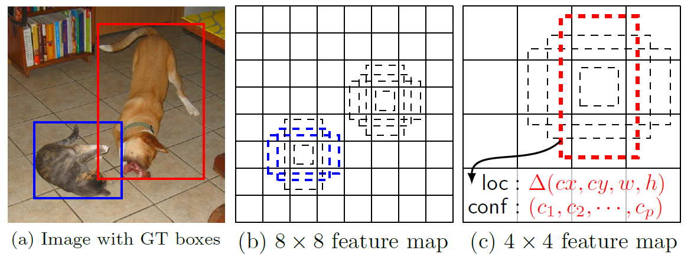

# Single Shot Detector (SSD) for Object Detection

  * SSD takes only one single shot to detect multiple objects within the image
  * RPN (regional proposal network) based approaches, e.g. R-CNN needs two shots:
    * first shot: generating region proposals
	* second shot: detecting the object of each proposal
  * So, SSD is much faster than RPN-based methods
    * SSD300: 74.3% mAP, 59FPS
	* SSD500: 76.9% mAp, 22FPS
	* Faster R-CNN: 73.2% mAP, 7FPS
	* YOLO v1: 63.4% mAP, 45FPS

---

## MultiBox Detector

  * SSD: Multiple Bounding Boxes for Localization (loc) and Confidence (conf)]

  * After convolutions, we extract **a feature layer** of size `\(m\times n\)` (number of locations) with `p` channels, such as `8x8` or `4x4`.
  * A `3x3` conv is applied on this `m x n x p` feature layer
  * For each location, we got `k` bounding boxes, with different sizes and aspect ratios.
  * For each of the bounding boxes, we will compute `c` class scores and `4` offsets relative to the original default bounding box shape.
  * Thus, we got `(c + 4) kmn` outputs.

---

## SSD Network Architecture (1)

  * To be more accurate, different layers of feature maps are also going through a small `3x3` convolutions.

---

## SSD Network Architecture (2)

  * `Conv4_3`: size `38x38x512`, apply `3x3` conv. `c` classes 
    * There are `4` bounding boxes, each have `(c + 4)` outputs
	* The output: `38x38x4x(c+4)`. If `20` object classes and one background class, the output is `38x38x4x(21+4)=144400`.
	* Bounding boxes: `38x38x4=5776`.
  * `Conv7`: `19x19x6=2166` boxes (`6` boxes for each location)
  * `Conv8_2`: `10x10x6=600` boxes (`6` boxes for each location)
  * `Conv9_2`: `5x5x6=150` boxes (`6` boxes for each location)
  * `Conv10_2`: `3x3x4=36` boxes (`4` boxes for each location)
  * `Conv11_2`: `1x1x4=36` boxes (`4` boxes for each location)
  * Total boxes: `5776 + 2166 + 600 + 15- + 36 + 4 = 8732`
  * For YOLO: `7x7` locations, each with `2` bounding boxes

---

## Loss Function

  * Loss function

$$
L(x,c,l,g)=\frac{1}{N}( L\_{conf} (x,c)+\alpha L\_{loc} (x,l,g))
$$

  * Two terms: `\(L_{conf}\)` and `\(L_{loc}\)`, where `N` is the matched default boxes.
  * Localization loss `\(L_{loc}\)`: the smooth `L1` loss between prediected box (`l`) and the ground truth box (`g`) parameters. These parameters include the offsets for the center point `(cx, cy)`, width (`w`) and height (`h`) of the bounding box. This loss is similar to Faster R-CNN.
  * Confidence loss `\(L_{conf}\)` is the softmax loss over multiple classes confidences (`c`). `\(\alpha\)` is set to 1 by cross validation. `\(x_{ij}^p=\{1,0\}\)` is an indicator for match `i`-th default box to the `j`-th ground truth box of category `p`.

  
  

---

## Scales and Aspect Ratios of Default Boxes

  * Scale of default boxes

$$
s\_k = s\_{min} + \frac{s\_{max}-s\_{min}}{m-1}(k-1),\quad k\in[1,m]
$$

  * Suppose we have `m` feature maps for prediction, we can calculate `Sk` for the `k`-th feature map.
    * `\(S_{min}=0.2\)`, `\(S_{max}=0.9\)`.
	* The scale at the lowest layer is `0.2`, the scale at the highest layer is `0.9`
	* All layers in between is regularly spaced
  * For each scale, `\(s_k\)`, we have `5` non-square aspect ratios:

$$
a_r \in \\{1,2,3,\frac12,\frac13\\}, \quad w_k^a=s_k\sqrt{a_r},\quad h_k^a=s_k/\sqrt{a_r}
$$

  * For aspect ratio of `1:1`, we got `\(s_k'\)`

$$
s\_k' = \sqrt{s\_ks\_{k+1}}
$$

  * Therefore, we can have at most `6` bounding boxes in total with different aspect ratios. For layers with only `4` bounding boxes, `\(a_r=1/3\)`, and `3` are ommitted.
---

## Some Details of Training

### Hard Negative Mining

  * Instead of using all the negative examples, we sort them using the highest confidence loss for each default box and pick the top ones so that the ratio between the negatives and positives is at most `3:1`.
  * This can leads to faster optimization and a more stable training.

---

### Data Augmentation

  * Each training image is randomly sampled by:
    * entire original input image
	* Sample a patch so that the overlap with objects is `0.1`, `0.3`, `0.5`, `0.7` or `0.9`
	* Randomly sample a patch
  * The size of each sampled patch is `[0.1,1]` or original image size, and aspect ratio from `1/2` to `2`.
  * After the above steps, each sampled patch will be resized to fixed size and maybe horizontally flipped with probability of 0.5, in addition to some photo-metric distortions[14].

---

### Atrous Convolution (Hole Algorithm / Dilated Convolution)

  * The base network is VGG16 and pre-trained using ILSVRC classification dataset.
  * FC6 and FC7 are changed to convolution layers as Conv6 and Conv7 which is shown in the previous image of SSD network.
  * Furthermore, FC6 and FC7 use Atrous convolution (a.k.a Hole algorithm or dilated convolution) instead of conventional convolution. And pool5 is changed from `2x2-s2` to `3x3-s1`.

  * As we can see, the feature maps are large at Conv6 and Conv7, using Atrous convolution as shown above can increase the receptive field while keeping number of parameters relatively fewer compared with conventional convolution.

---

## Results

  * There aretwo Models: SSD300, SSD512
    * SSD300: `300x300` input image, lower resolution, faster
    * SSD512: `512x512` input image, higher resolution, more accurate

---

## References

  * [Review: SSD — Single Shot Detector (Object Detection)](https://towardsdatascience.com/review-ssd-single-shot-detector-object-detection-851a94607d11)
  * [SSD: Single Shot MultiBox Detector](https://arxiv.org/abs/1512.02325), WeiLiu, ECCV 2016

